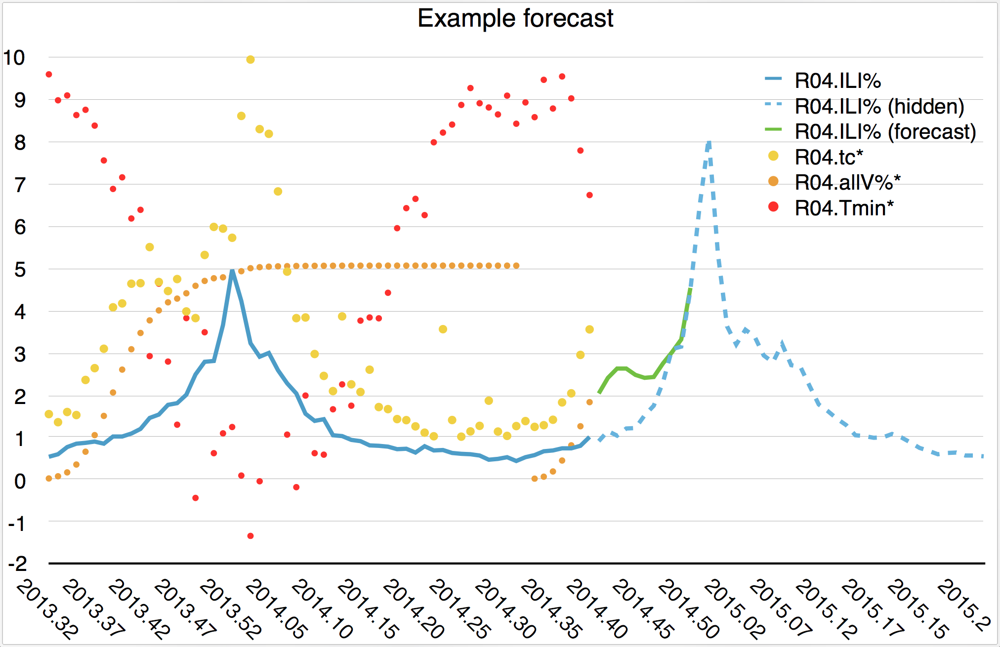

# PPAML Challenge Problem 7, phase 3

The task in this phase of CP7 is to predict [seasonal rates](https://en.wikipedia.org/wiki/Flu_season) of Influenza-Like Illness (_ILI_ or 'flu') in 60 distinct sub-populations of the continental US, ranging in size from the entire country to individual counties.

In addition to historical ILI rate data for each population, three different kinds of covariate data, representing flu-related tweets, vaccination claims, and weather, are provided for use in solutions.
In a _simulated nowcast_ experiment, all four kinds of variables will be made available to solutions, one week at time, over the target season.

---

## Data sets

Data is provided as a single JSON file containing constants that describe the target populations, and as a set of CSV files that contain time-series variable data for some of the populations.
Each time series has weekly data following the [MMWR week calendar](epiweek.py).
(The official CDC flu season runs from MMWR week 40 through week 20 of the following year.)
Each week is encoded as a fixed-point number: for example, the last week in 2015 is represented as "2015.52".

### Population data

The populations form a geographic containment hierarchy:

- The United States is the root
- [HHS Regions 1 – 10](https://www.hhs.gov/about/agencies/iea/regional-offices/index.html) divide the US at the lowest resolution
- An HHS region is composed of several states, identified with two-letter postal codes
- A state contains counties, each of which has a [four-digit FIPS code](https://en.wikipedia.org/wiki/Federal_Information_Processing_Standard_state_code)

For states and counties, [`demographics.json`](data/demographics.json) provides population count estimates and other demographic information from the US Census Bureau, under the `"data"` key.
For counties, a list of FIPS codes of adjacent counties is also included.
FIPS codes of the counties or states that constitute each population can be found using the hierarchy under the `"indices"` key. 

### ILI rates

The CDC has a voluntary flu surveillance program called ILINet.
Each week, participating clinics submit counts of patients diagnosed with ILI to their state health department, along with their total patient counts.
These counts form the basis for the published rates for each HHS region.
Some state health departments also publish their weekly rates directly.

Filename | populations | source | first week | last week | notes
-------- | ----------- | ------ | ---------- | --------- | -----
<nobr>[`USA-flu.csv`](data/USA-flu.csv)</nobr> | Continental United States and 10 HHS Regions | CDC ILINet | 1997.40 | 2015.29 | off-season data missing from early years
<nobr>[`MS-flu.csv`](data/MS-flu.csv)</nobr> | Mississippi and 9 [Public Health Districts](http://msdh.ms.gov/msdhsite/_static/resources/3468.pdf) | MS Department of Health | 2012.48 | 2015.20 | no off-season data
<nobr>[`NC-flu.csv`](data/NC-flu.csv)</nobr> | North Carolina | NC Division of Public Health | 2001.40 | 2015.20 | includes diagnosed and total patient counts; no off-season data
<nobr>[`NJ-flu.csv`](data/NJ-flu.csv)</nobr> | New Jersey and 21 counties | NJ Department of Health | 2005.39 | 2015.20 | includes reported rates from long-term care facilities (`.ltc`), schools (`.sch`), and emergency clinics (`.emr`) in each county; off-season data only for 2009
<nobr>[`RI-flu.csv`](data/RI-flu.csv)</nobr> | Rhode Island | RI Department of Health | 2013.40 | 2015.20 | includes rates for five age ranges; no off-season data
<nobr>[`TN-flu.csv`](data/TN-flu.csv)</nobr> | Tennessee and  13 [Health Regions](https://tn.gov/health/topic/localdepartments) | TN Department of Health | 2009.32 | 2015.29 | six regions are individual counties; includes off-season data
<nobr>[`TX-flu.csv`](data/TX-flu.csv)</nobr> | Texas | TX Department of State Health Services | 2005.40 | 2015.29 | includes counts for four or five patient age ranges; includes off-season data starting in 2009

Some state health departments publish additional data which may be useful.
The column headers in each CSV are of the form `[POP].[VAR]`, with each `VAR` described in the table below.

Variable name | populations | meaning
------------- | ----------- | -------
`%ILI` | MS, NC, RI, TN, TX, USA | percentage of patients diagnosed with ILI
`#ILI` | NC, TX | number of patients diagnosed with ILI
`#patients` | NC, TX | total number of patients
`#sites` | TX | number of clinics reporting
`ltc` | NJ | percentage of ILI patients in long-term care facilities 
`sch` | NJ | percentage of ILI patients in schools 
`emr` | NJ | percentage of ILI patients in hospital emergency departments
<nobr>`age[H]-[L]`</nobr> | RI, TX | percentage of ILI patients between ages _H_ and _L_, inclusive   **note:** The TX health dept reported ages in four bins before week 2009.40, and five bins afterward. For those later weeks, column `TX.age25-64*` contains data for ages 25 – 49.

### Tweet counts

Geo-located tweets which included the words 'flu' or 'influenza' during a four-year period were aggregated to populations and MMWR weeks and counted to form a social media data set.

To support adjustments for the differences between the Twitter user base and the general US population, a small table of demographic information is provided.
The column labeled `% 2016 (US)` shows percentages of Twitter users in various demographic categories among _all_ US adults, while other columns show percentages among US adult _internet users_.

Filenames | source 
--------- | ------
<nobr>`[POP]-tweets.csv`</nobr> | [GNIP Historical PowerTrack](https://gnip.com/historical/historical-powertrack/)
[`twitter-demographics.csv`](data/twitter-demographics.csv) | Pew Research Social Media Updates [2016](http://www.pewinternet.org/2016/11/11/social-media-update-2016/) and [2014](http://www.pewinternet.org/2015/01/09/social-media-update-2014/)

Variable name | meaning
------------- | -------
`tc` | tweet counts

### Medicare vaccination claims

Medicare recipients are eligible for subsidized flu vaccinations.
The National Vaccine Program Office tracks the total number of eligible recipients for each county and flu season, for all ages as those 65 and older.
The NVPO records the vaccinated percentage of those eligible on a weekly basis.
These percentages are cumulative and thus non-decreasing over a flu season.

Filenames | source 
--------- | ------
<nobr>`[POP]-vaccinations.csv`</nobr> | [US Department of Health & Human Services National Vaccine Program Office](https://www.hhs.gov/nvpo/about/resources/interactive-mapping-tool-flu-vaccination-claims-by-week/)

Variable name | meaning
------------- | -------
`all` | total number of eligible recipients
`allV%` | percentage of eligible recipients vaccinated
`65+` | number of eligible recipients age 65 and over
`65+V%` | percentage of eligible recipients age 65+ vaccinated

### Weather data

In temperate climates like the continental US, flu epidemics are much more prevalent during cold weather.
To encourage teams to explore this correlation, aggregated weather data are provided for each MMWR week and each population.

Filenames | source 
--------- | ------
<nobr>`[POP]-weather.csv`</nobr> | [National Oceanic and Atmospheric Administration _GHCN-Daily_](https://www.ncdc.noaa.gov/oa/climate/ghcn-daily/)

Variable name | meaning
------------- | -------
`Tmax` | mean daily high temperature, in degrees Celsius
`Tmin` | mean daily low temperature, in degrees Celsius
`prcp` | mean daily percipitation, in millimeters

---

## Problem statement and evaluation protocol

Denoting ILI rate data for population _p_ and week _w_ as _Ipw_, and similarly for all covariates _C_, a _forecaster_ for week _n_ extending _m_ weeks can be described as a function

 _Fp,n,m_ : { _Ipw_ , _Cpw_ | _w_ < _n_ } → { _Ipw_ | _n_ ≤ _w_ ≤ _n_ + _m_ }

Given data sets _I_ and _C_, as described above, solutions will produce a set of forecasts <nobr>{ _Fp,n,m_(_I_, _C_) }</nobr> where

Parameter | value
--------- | -----
_p_ | any of the 60 populations
_n_ | weeks 2015.30 ... 2016.20
_m_ | team discretion

Each forecast will be evaluated against ground truth data <nobr>{ _Ipw_ | _n_ ≤ _w_ ≤ _n_ + _m_ }</nobr> and assigned a sum of squared errors (SSE) score _s_.
Higher _m_ and lower _s_ are better.

In chart above, _n_ = 2014.40, _m_ = 10, and _p_ = HHS Region 4.
Three of the eight covariates are shown point-wise, in warm colors.
(The * after their names indicates that they have been multiplied by scalars to fit on the chart.)
While _I_ and _C_ data prior to week 2013.32 are not shown, they are available to the forecaster function.

In concrete terms _Ipw_ and _Cpw_, for all populations _p_ and weeks _w_, 2015.20 < _w_ ≤ _n_ ≤ 2016.20, will be represented in a file named `week-`_n_`.txt`.
This file will consist of concatenated CSV data of the same format as those provided, preceded by filenames, and followed by blank lines.
The basic idea is that each line of data could be appended to the appropriate file to continue the time series.
(An [example](data/week-2014.42.txt) is provided with data from the previous season, covering weeks 2014.41 and 2014.42.)

Solutions should read such a file (as well as the contents of the present `data` directory) and produce a similar file, containing only lines with forecast ILI rates for weeks _n_ through _n_ + _m_ for each target population `[POP]-flu.csv`.
To avoid re-computing a full predictive model for each week _n_, solutions are encouraged to save their results in between program runs.
