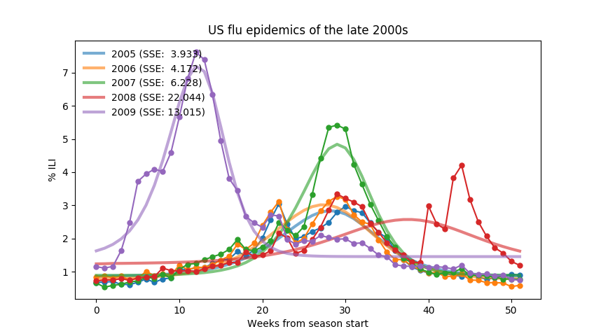

# A minimal solution

I decided to use my Galois "innovation time" for 2017 to finish developing the CP7.3 reference model I had begun earlier in the year.
Originally, the plan had been to use the challenge problem to drive development of Grappa, our experimental PPL.
This didn't work out as well as we would have liked, but along the way I started building a sort of model sketch in plain old Python.
My goals and constraints were pretty simple:

- Computationally efficient enough to run quickly on a laptop
- No fancy libraries, just standard NumPy function minimization
- Only use the primary ILI time series, no covariates
- Use some basic domain knowledge for an epidemic model
- Make reasonably adequate predictions:
	- Roughly correct seasonal peak height, width, and placement
	- Decreasing SSE scores over nowcast target season

My intuition, gained in collecting the data set, was that this was all quite achievable, even without any form of advanced statistics.
The old hope was, of course, that a more knowledgeable modeler applying a more mature PPL to the full data set (including covariates) would come up with a model showing obvious improvements over this "baseline" solution:
ideally, some combination of more elegant code and better results.
Now that the PPAML project has finished, I'd still like to make this data set available to the PPL community (and other predictive modelers),
with the new hope that a halfway-decent simple model using standard tools will encourage other, better solutions.

I had 24 hours of innovation time available this year.
In November, when I began to spend it, I already had built two candidate models of seasonal flu dynamics -- one using SIR and another ad-hoc squared-exponential curve.
I also had a pre-processing script to split the data into seasons,
and had begun to fit the models to the complete seasonal data.
The general idea was to use some basic summary statistics over the fitted model parameters to guide the initial nowcast model,
which would then adapt to newly available data over the course of the target season.

The advantages of the SIR model are that it's a standard causal mechanism,
generally appropriate to the common flu (from which most patients recover fairly quickly), and very easy to implement.
The disadvantages are two-fold.
First, it may be so much of an oversimplification that it doesn't actually fit the observed dynamics very well; a common fate of simple models.
For example, it doesn't include any concept of geographically or socially structured contagion,
composition of sub-epidemics due to multiple virus strains,
or the potential influence of "obvious" covariates like vaccinations or seasonal temperature differences,
all of which could very well affect the shape of the observed seasonal peaks.
The second disadvantage of SIR is that, like many practical ODE systems,
it is nonlinear and, [until 2014](https://arxiv.org/pdf/1403.2160.pdf), had no known analytical solution.
Even with the Harko-Lobo-Mak solution in hand, I see no obvious mapping from the observed weekly infection rates
(hypothetically, noisy samples of the *I* component of the system) to the handful of parameters which generate a specific SIR curve.
Of course, someone more experienced with dynamical systems and statistics may well obtain better results.

**TODO**: explain generic (descriptive) growth model as implemented

## Results

On June 20, when I stopped working on the SIR model for the PPAML project, I put together a [brief summary](results/06-20/results.html) of SIR model fits to the various historical seasons in the four target populations.
The charts are rather noisy, but I found the overall results promising, at least for the larger populations.
The standard deviations of the `beta` and `gamma` paramater distributions are comfortingly small.

When I started spending innovation hours in November, I first tuned my SIR model's initial parameters by iteratively evaluating the model on the USA population, excluding some outlier years.
I then spent a little effort to make the charts more readable:

In interpreting these results, it's important to keep in mind that they are "retrodictions",
obtained by minimizing the total discrepancy (as SSE) between an SIR curve and the observed clinical infection rates over an entire season.
Even so, the model peaks are almost always below the actual peaks, even when the fit is otherwise pretty good.

To visualize the distribution of model parameters, I used a scatter plot,
collapsing `beta` and `gamma` into the basic reproductive ratio `R0` on the x-axis.
The y-axis shows epidemic "onset week", a horizontal translation from the official season start.
In developing the model, I found that this was more useful than the *I(0)* parameter which it replaces: in my SIR model, *I(0)* is a constant.
This approach allows tighter bounds on `beta` and `gamma`.
The dots are colored according to SSE scores (blue is good, red bad) and sized by model peak magnitudes.
They appear reasonably clustered, which is good.

At the end of the year, when I had to use my remaining innovation hours or lose them, I decided to apply my SIR model, as it stood, to some actual predictions.
The orange curves show successive iterations of the model, colored darker as more data is revealed during the season's simulated progression.

These forecast scores do indeed improve over the course of the season, but the initial predictions are sort of absurdly alarmist.
The explanation is simple: the model doesn't yet contain enough knowledge about previous seasons.
All it has are some parameter bounds on the minimization search, clearly insufficient to constrain its behavior in the absense of data from later in the season.
In Bayesian terms, we might say it has a weak or inadequate prior distribution.
But this can be fixed!

## Future work

## Lessons learned